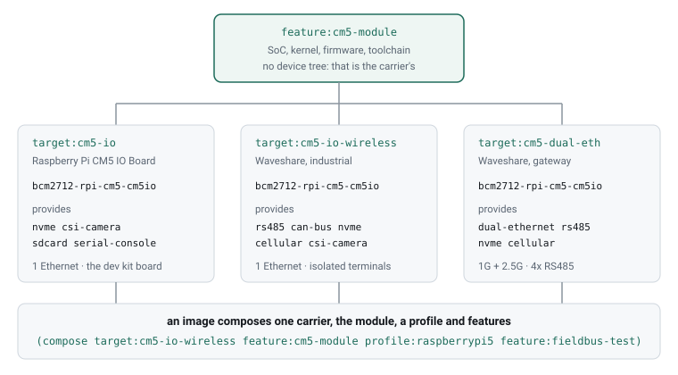

# silt

Composable S-expressions over Kconfig, producing real bootable ARM64 images.

You describe what you want as reusable fragments. Silt merges them, checks them
against the real Kconfig constraint model, completes them into a valid configuration,
explains anything that conflicts, and emits a `defconfig` plus a kernel `.config` that
Buildroot and kbuild accept unchanged. Buildroot builds it. It boots.

Silt compiles nothing. Its output artifact is a validated configuration.

> **Status: it works.** Ten images across three architectures, built from this
> repository and flashed onto the boards. Every console block below is real
> output, not illustration. See [Status](#status) for what is and is not done.

```console
$ silt check --buildroot ~/buildroot
ok  117 files, 52 fragments, 1 rule blocks, 47 images

$ ci/silt-build.sh images/raspberrypi3-64-bringup.sx
prefix raspberrypi3-64-bringup  f3694de6cca7a7354019a474  (from raspberrypi3-64, 466 symbols shared)
prediction and kbuild agree on every symbol kbuild knew
...
store  raspberrypi3-64-bringup  f3694de6cca7a7354019a474  (246s)
```

---

## Why

### Kconfig deletes your request without telling you

Take a working Buildroot config, ask for a camera, and ask for static linking.
libcamera has `depends on !BR2_STATIC_LIBS`, so this cannot be satisfied:

```sh
cd buildroot
make qemu_aarch64_virt_defconfig
echo 'BR2_PACKAGE_LIBCAMERA=y' >> .config
echo 'BR2_STATIC_LIBS=y'       >> .config
make olddefconfig
grep LIBCAMERA .config
```

```
exit=0
stderr: 0 bytes
BR2_PACKAGE_LIBCAMERA    ABSENT ENTIRELY
```

Not `# BR2_PACKAGE_LIBCAMERA is not set`. The symbol is **removed from the file**. You
asked for a camera, got a config that builds cleanly without one, and the only way to
find out is to diff what you wrote against what kbuild kept.

Sixty seconds to reproduce. This is the defect Silt exists to catch — and the standard
Silt is held to, because *if Silt's own losses are silent, it has reproduced the bug it
was built to fix.*

Written as fragments, the same request is a conflict with two named sources rather than
a deletion:

```lisp
(fragment profile:minimal (buildroot (y BR2_STATIC_LIBS)))
(fragment feature:camera  (buildroot (y BR2_PACKAGE_LIBCAMERA)))
;; libcamera has `depends on !BR2_STATIC_LIBS` → UNSAT, with both file:line cited
```

### Buildroot expresses kernel requirements in English

Nineteen package `Config.in` files reference kernel `CONFIG_*` symbols. Every single
reference sits inside a `help` block, because Buildroot's Kconfig cannot reach into the
kernel's namespace — they are two separate trees:

```
fscryptctl     "requires a kernel with CONFIG_EXT4_ENCRYPTION=y"
18xx-ti-utils  "CONFIG_NL80211_TESTMODE must be enabled in the kernel"
bcc            "Compile kernel with CONFIG_IKHEADERS"
dpdk            nine symbols under "Optional but recommended kernel configurations"
```

Nothing enforces any of it. You read the prose, you go edit a different file in a
different format, and if you forget, it fails at runtime on the device.

One rule per help string, checked instead of read:

```lisp
(rules cross-tree
  (when (y BR2_PACKAGE_FSCRYPTCTL)    (y CONFIG_EXT4_ENCRYPTION))
  (when (y BR2_PACKAGE_BCC)           (y CONFIG_IKHEADERS))
  (when (y BR2_PACKAGE_18XX_TI_UTILS) (y CONFIG_NL80211_TESTMODE)))
```

```sh
grep -rl 'CONFIG_[A-Z0-9_]' buildroot/package/*/Config.in | wc -l    # 19
```

---

## What you write

Fragments are declarative and composable. A target fixes hardware and mentions no
packages. A profile fixes userspace policy and mentions no hardware.

```lisp
;; fragments/targets/qemu-aarch64-virt.sx
(fragment target:qemu-aarch64-virt

  (buildroot
    (y BR2_aarch64)
    (y BR2_cortex_a57)
    (value BR2_TARGET_GENERIC_GETTY_PORT "ttyAMA0"))

  (linux
    ;; Kconfig permits =m for both. The rootfs is on virtio and the console is
    ;; needed before userspace, so neither can be a module. Kconfig cannot express
    ;; boot ordering — this is why the fragment exists at all.
    (y CONFIG_VIRTIO_BLK)
    (y CONFIG_SERIAL_AMBA_PL011_CONSOLE))

  (provides
    (capability mmu)
    (capability virtio)
    (capability serial-console)))
```

Features are written against **capabilities**, not against a specific board's symbols,
which is what makes them reusable across targets:

```lisp
;; fragments/features/camera.sx  — three lines
(fragment feature:camera
  (requires  (capability csi-camera))
  (buildroot (y BR2_PACKAGE_LIBCAMERA))
  (linux     (at-least m CONFIG_VIDEO_DEV)))
```

An image is a composition and almost nothing else:

```lisp
;; images/qemu-arm-dev.sx
(image qemu-arm-dev
  (compose target:qemu-aarch64-virt profile:minimal feature:networking)
  (linux (custom-version "6.18.7")))
```

### The rule that keeps fragments small

> **State only what Kconfig cannot derive.**

Anything implied by an existing `depends on` or `select` is omitted. `feature:camera`
is three lines; a first draft had fourteen, and the other eleven were all derivable —
deleting them changed nothing about the solved model. What survives the rule falls
into five categories: **choices**, **strengthening** (Kconfig permits `=m`, boot order
does not), **cross-tree implications**, **negative intent**, and **capabilities**.

A linter enforces this once the constraint model exists: any line whose removal does
not change the solved model is dead.

### The forms you write most of the time

| Form | Meaning | Lowers to |
| --- | --- | --- |
| `(y SYM)` | hard: built in | `sym_y` |
| `(m SYM)` | hard: module | `sym_m` |
| `(n SYM)` | hard: off | `¬sym_y ∧ ¬sym_m` |
| `(at-least m SYM)` | module or built-in | `sym_y ∨ sym_m` |
| `(prefer y SYM)` | soft; yields, and says so | MaxSAT soft clause |
| `(value SYM "str")` | string/int/hex | emptiness modeled, value passed through |
| `(when A B)` | guarded | `A ⇒ B` |

Those seven cover almost everything you type. The full language is thirty-four
keywords — composition, escape hatches, repair policy — plus nine more the importer
emits. All of it is specified in [GRAMMAR.md](GRAMMAR.md), written before the parser so
there is something for the parser to be tested *against* rather than defined by.

`at-least` exists only because this builds real images — module versus built-in changes
what lands in the rootfs. `when` never executes anything; it lowers to an implication
and the solver decides, which is how the representation stays data rather than becoming
a Lisp.

### Reuse without functions

No lambdas, no macros, no parameters. Reuse is **under-specification plus merge**, the
CUE-style answer. `target:qemu-aarch64-virt` never names a rootfs format;
`profile:minimal` never names hardware. Composing them unifies the two and each fills
the other's hole. Swapping the target changes hardware and nothing else — and that is
testable:

```sh
silt diff images/qemu-arm-dev.sx --swap target:qemu-aarch64-virt=target:rpi4-64
```

If that swap requires editing a feature, the boundaries are wrong.

### The cross-tree rules

The file that does what neither Kconfig tree can. Those 19 help strings, made
machine-checkable:

```lisp
;; fragments/rules/cross-tree.sx
(rules cross-tree
  (when (y BR2_PACKAGE_WPA_SUPPLICANT) (at-least m CONFIG_MAC80211))
  (when (y BR2_PACKAGE_LIBCAMERA)      (at-least m CONFIG_VIDEO_DEV))
  (when (y BR2_PACKAGE_DHCPCD)         (y CONFIG_PACKET))
  (when (y BR2_INIT_SYSTEMD)           (y CONFIG_CGROUPS)
                                       (y CONFIG_INOTIFY_USER)
                                       (y CONFIG_FHANDLE))
  ;; A module-only filesystem cannot hold the root filesystem: nothing can load it
  ;; before it is mounted. Neither tree can express boot ordering.
  (when (y BR2_TARGET_ROOTFS_EXT2)     (n CONFIG_EXT4_FS_MODULE)))
```

---

## What comes out

```console
$ silt solve images/qemu-arm-dev.sx

SAT   qemu-arm-dev
  stated         9 buildroot, 6 linux
  completed    451 buildroot, 1,847 linux
  opaque         3  carried verbatim, not solved
  env-derived    4  BR2_VERSION BR2_HOSTARCH BR2_BASE_DIR BR2_HOST_GCC_VERSION

  cross-tree rules fired 3:
    BR2_PACKAGE_DHCPCD     → CONFIG_PACKET=y     rules/cross-tree.sx:27
    BR2_TARGET_ROOTFS_EXT2 → CONFIG_EXT4_FS=y    rules/cross-tree.sx:35

$ silt emit images/qemu-arm-dev.sx -o out/
  out/defconfig        18 symbols  → BR2_DEFCONFIG
  out/linux.config     76 symbols  → BR2_LINUX_KERNEL_CUSTOM_CONFIG_FILE
```

One description, both trees, guaranteed consistent. That is the step with no
equivalent today.

The defconfig carries the hash of the composition that produced it, so a built
tree can be told apart from a stale one:

```console
$ head -3 ~/br-rpi3/defconfig
# Generated by silt from raspberrypi3-64-bringup. Do not edit.
# silt-solution: b4950057966312c5534dbb2e
# Fragments: target:raspberrypi3-64 profile:raspberrypi3-64 feature:dev-ssh ...
```

`silt externals` answers the other question a build needs, which is otherwise a
hand-maintained list pasted onto every `make` line:

```console
$ silt externals images/raspberrypi0-tailscale.sx --buildroot ~/buildroot
/home/you/silt/packs/dev-ssh/br2-external:/home/you/silt/packs/tailscale/br2-external:/home/you/silt/packs/usb-gadget/br2-external
```

Ask why anything is the way it is, across both trees:

```console
$ silt why CONFIG_VIDEO_DEV images/edge-camera.sx

CONFIG_VIDEO_DEV = m
  feature:camera                 fragments/features/camera.sx:12
  cross-tree rule                fragments/rules/cross-tree.sx:22
  m not y: (at-least m) allows both; baseline has it m, so m costs 0 changes
```

---

## Checking against the tree

A fragment asserts things that are true of a Buildroot *release*, not of
Buildroot in general. `silt check --buildroot` imports the release's 9,000-odd
symbols and verifies every claim against them:

```console
$ silt check --buildroot ~/buildroot

ok  dev-board          18 symbols checked against buildroot 2025.02.16

edge-camera — 1 problem(s), buildroot 2025.02.16
  fragments/features/camera.sx:10: BR2_PACKAGE_LIBCAMERA requires !BR2_STATIC_LIBS
                                   (package/libcamera/Config.in:7)
  but BR2_STATIC_LIBS is stated y by profile:minimal at fragments/profiles/minimal.sx:25
```

It catches symbols absent from that release, type mismatches, and dependencies
the composition contradicts. Passing `--buildroot` to `emit` as well lets rules
fire on symbols Kconfig's own `select` machinery will enable — a rule on
`BR2_PACKAGE_SYSTEMD` is true of any image choosing `BR2_INIT_SYSTEMD`, which
selects it, even though nothing states it. Images record the release they were checked against
with `(verified-against (buildroot "2025.02.16"))`, and a mismatch is reported
before anything else — the findings only mean something for the tree they were
checked on.

## Building and booting it

Everything above checks configuration: that a symbol exists, that kbuild keeps
it, that two trees agree. None of it can catch a setting which is real, spelled
correctly, passes every check and does nothing — `BR2_TARGET_UBOOT_BOARDNAME`
under the Kconfig build system was exactly that. Only a boot can.

```console
$ ci/boot-test.sh images/qemu-arm-boot.sx --buildroot ~/buildroot
+ silt emit images/qemu-arm-boot.sx -o out-boot --buildroot ~/buildroot --external br2-external
solution 1f5006a8a88f3dae5025920d
+ make -C ~/buildroot O=out-boot/build BR2_EXTERNAL=... defconfig BR2_DEFCONFIG=out-boot/defconfig
+ make -C ~/buildroot O=out-boot/build
+ qemu-system-aarch64 -M virt -cpu cortex-a53 -nographic ...
ok qemu-arm-boot booted and passed 6 assertions
```

The QEMU invocation is not invented: it is read from the `readme.txt` of the
board Buildroot itself ships, so it stays matched to the release in use. The
assertions live in `ci/boot/<image>.expect` and are about what the fragments
claimed — `hello-silt` prints its line because `feature:hello-silt` stated the
symbol that builds it.

Two images, run on demand rather than on every push: a build is tens of minutes,
and a test nobody waits for is a test nobody runs. `qemu-arm-boot` is
`qemu-arm-dev` with one fragment added, so if it boots and `qemu-arm-dev` does
not, the difference is that fragment.

The package it boots comes from a pack: a directory holding fragments, the
`br2-external` tree that implements them, and a declaration of what it offers.

```console
$ silt check --buildroot ~/buildroot --pack packs/hello-silt
ok  pack hello-silt    0.1.0, 1 fragment(s), br2-external
ok  qemu-arm-boot      18 buildroot symbols checked against buildroot 2025.02.16
```

```lisp
(pack hello-silt
  (version "0.1.0")
  (requires (buildroot "2025.02.16"))
  (external "br2-external")
  (provides (feature hello-silt)))
```

`packs/k3s` is the case the cross-tree argument was made for: a package Buildroot
does not ship, a userspace k3s cannot choose for itself, and fifty kernel options
in another tree in another format. The kernel list is k3s's own
`contrib/util/check-config.sh`, transcribed symbol for symbol, and
`silt complete --linux` reported twenty of them being dropped by kbuild — every
one hanging off a `CONFIG_NETFILTER*` parent the script never mentions, because
on a distribution kernel it is already on. That is the hour-into-a-build
discovery, made in a second.

`packs/nanopi-r2s` is the same shape with no packages in it at all: a board,
imported from Buildroot's own defconfig, carrying the four files that defconfig
pointed at. Composed with this repository's `profile:minimal`, which knows
nothing about the board, and checked before anyone waits for a build:

```console
$ silt check --buildroot ~/buildroot --pack packs/nanopi-r2s
ok  pack nanopi-r2s     0.1.0, 1 fragment(s), br2-external
ok  nanopi-r2s-minimal  48 buildroot symbols checked against buildroot 2025.02.16
```

A pack can carry files as well as symbols:

```lisp
(path BR2_ROOTFS_OVERLAY "overlay")
```

relative to the pack's br2-external tree, checked to exist before anything builds, emitted as
`BR2_ROOTFS_OVERLAY="$(BR2_EXTERNAL_SILT_PATH)/overlay"` so the defconfig names no
machine's directory layout, and hashed into the solution — an overlay that
changed is a different configuration, even with identical symbols.

That declaration is the interface, and it is checked both ways: everything
promised must exist, and a fragment the pack does not declare is an error —
a consumer can compose it, and the pack does not know it maintains it. `--pack`
loads the fragments and the tree together, because the fragment states
`BR2_PACKAGE_HELLO_SILT` and the tree is what makes that symbol exist.

A checkout with a package added to `package/Config.in` is no longer the release
it claims to be, and every `verified-against` pin here is about a release. The
generated `.br2-external.in.*` files come from Buildroot's own
`support/scripts/br2-external`, not from a reimplementation of its format.

## Four bugs it caught, with the output

Every one of these is a real finding on a real board, and the point of each is
the same: the cost of being told was a second, and the cost of not being told
was a build, a flash, and an evening on a bench.

**A feature that only worked by accident.** `feature:fieldbus-test` needs kmod's
`modprobe`, because the Pi kernels compress modules with xz and BusyBox's
modprobe cannot read them. `BR2_PACKAGE_KMOD_TOOLS` sits behind
`BR2_PACKAGE_BUSYBOX_SHOW_OTHERS`, which all three Raspberry Pi profiles happen
to set — so the feature had been wrong since it was written and nothing showed
it. Importing an i.MX 8M Plus, whose profile does not set it, showed it before
the first build on that board:

```console
$ silt check --buildroot ~/buildroot
imx8mp-evk-bringup — 1 problem(s), buildroot 2025.02.16
  packs/fieldbus-test/fragments/features/fieldbus-test.sx:81:
    buildroot:BR2_PACKAGE_KMOD_TOOLS: asked for y, kbuild would write absent
  stated by feature:fieldbus-test
```

The visible failure would have been `vcan0` missing after a forty-minute build,
with nothing in the logs pointing at the cause.

**A conflict with no correct automatic answer.** A Pi Zero has no Ethernet, so
`feature:usb-gadget-net` makes its USB port a network interface — which needs
`dtoverlay=dwc2` in `config.txt`. But every Raspberry Pi target already names a
`config.txt` of its own:

```console
error: image raspberrypi0-bringup: conflicting values for
       buildroot:BR2_PACKAGE_RPI_FIRMWARE_CONFIG_FILE
  "board/raspberrypi0/config_default.txt"          target:raspberrypi0
  "$(BR2_EXTERNAL_USB_GADGET_PATH)/files/config.txt" feature:usb-gadget-net
```

Silently preferring one firmware config over another would be a guess about how
the board boots, so the image says which, with an `(override ...)`, and the
feature carries the kernel options and the init script.

**A model of the hardware that was wrong.** The first attempt at Compute Module 5
support had a target for the module and a target for the carrier board:

```console
error: images/cm5-dual-eth.sx:2: compose names 2 targets
       (target:cm5, target:cm5-dual-eth); a target is exactly one board
```

Right — and with a compute module the *board* is the carrier, the thing with the
connectors, while the module is something you plug into it. The refusal produced
a better model than the one it refused.

**And a bug in silt itself.** `BR2_LINUX_KERNEL_CONFIG_FRAGMENT_FILES` is a
space-separated list, and emit wrote its own generated `linux.config` into it as
the last line of the defconfig — so a board naming a fragment of its own lost it.
On the Pi 5 that fragment is `linux-4k-page-size.fragment`, without which the
bcm2712 defconfig builds a 16k-page kernel. Every Pi 5 image had been built with
the wrong page size. It booted. Nothing complained.

That one is the standard this project holds itself to: *if silt's own losses are
silent, it has reproduced the bug it was built to fix.* The fix was to combine
rather than replace in emit, and to make `fixpoint` treat a list constraint as
membership rather than equality.

---

## Boards

Ten images, three architectures, all checked and most of them built:

| image | board | what it is |
| --- | --- | --- |
| `raspberrypi3-64` | Pi 3 B/B+ | the plain board |
| `raspberrypi3-64-bringup` | Pi 3 | the appliance: Modbus, OPC UA, CAN, MQTT, HTTP config |
| `raspberrypi3-64-vpn` | Pi 3 | the appliance plus WireGuard |
| `raspberrypi3-64-media` | Pi 3 | the appliance plus cameras and streaming |
| `raspberrypi0-bringup` | Pi Zero | the appliance, reachable over its own USB cable |
| `raspberrypi5-media` | Pi 5 | cameras, MJPEG in a browser, RTP out |
| `imx8mp-evk-bringup` | NXP i.MX 8M Plus EVK | the appliance on aarch64 with real CAN |
| `cm5-io`, `cm5-io-wireless`, `cm5-dual-eth` | Compute Module 5 | one module, three carrier boards |

The CM5 set is the argument for the whole language. A Compute Module has no
connectors, so what a board can do belongs to the carrier it is plugged into:



Silt arrived at that shape by refusing the first one. A target for the module
and a target for the carrier is two targets, and "a target is exactly one
board" — which is right, because with a compute module the board is the
carrier. So a carrier fragment states its device tree and what it has
populated, the module composes onto it, and swapping carriers is one line:

```lisp
(image cm5-io-appliance
  (compose
    image:cm5-io              ;; ← the only line that changes
    feature:dev-ssh
    feature:modbus
    feature:fieldbus-test))
```

Capabilities are how a board says what it has, and how a feature says what it
needs. Neither binds to a Kconfig symbol, because a board either has the
transceiver fitted or it does not and no configuration option knows:

```lisp
(fragment target:cm5-io-wireless
  (provides
    (capability rs485)
    (capability can-bus)
    (capability nvme)
    (capability cellular)))
```

A Modbus RTU feature will require `(capability rs485)`, and composing it onto a
carrier without one fails at check time rather than on a bench.

---

## Reusing Buildroot work

`ci/silt-build.sh` builds an image, or doesn't, depending on what it already has:

```
hit      this exact image was built before; copy the artifact out
prefix   a stored tree is a safe starting point; build only the difference
miss     nothing safe to start from; build from nothing
```

Measured on a 32-core VM, Buildroot 2025.02.16:

| | build | what was new |
| --- | --- | --- |
| `raspberrypi3-64` | **1132s** | everything: toolchain, kernel, BusyBox |
| `cm5-io` | **1158s** | everything, different SoC |
| `raspberrypi3-64-bringup` | **246s** | ~13 libraries and 6 daemons |
| `raspberrypi3-64-media` | **734s** | GStreamer, ffmpeg, x264, boost |
| `raspberrypi3-64-vpn` | **65s** | one package |
| `cm5-io-wireless` | **66s** | a different carrier board |
| anything already built | **3s** | nothing |

The cost of an image is what is new in it, not what is in it.

### Why a prefix is safe

Buildroot rebuilds from stamp files, not from inputs. Restore a tree built with
another configuration and every package already stamped is skipped, whatever the
new configuration says. So a stored tree is only safe when nothing already built
in it would have been built differently — and silt can answer that without
running make, because `silt complete` predicts the full `.config` an image will
become:

```
added symbol     fine, Buildroot builds it
changed value    unsafe, whatever depended on it is already stamped
removed symbol   unsafe, and this is the monotonicity rule made mechanical
```

That last line is what the test actually enforces, and it is worth seeing refuse:

```console
target = the plain Pi 3 board
  reject raspberrypi3-64-bringup   (BR2_PACKAGE_CAN_UTILS=y)
```

`can-utils` is built and installed in that tree, and nothing would uninstall it,
so the appliance tree may not be a starting point for an image that never asked
for it. Different architectures reject on `BR2_ARCH`; a different FPU rejects on
`BR2_ARM_FPU_VFPV4`.

Two classes of symbol are excluded, and finding the second one took a puzzled
afternoon. Symbols read after every package is built, by steps that re-run on
every `make`: the overlays, the post-build and post-image scripts, the
filesystem size. And symbols Buildroot fills in from the invocation rather than
the configuration — including `BR2_EXTERNAL_<NAME>_VERSION`, which is `git
describe` of the external tree. That one changes on every commit, so before it
was excluded, **every stored tree was disqualified the moment anything was
committed**, and a one-package image took twenty-two minutes instead of one.

### Two checks bracket every build

```console
$ ci/silt-build.sh images/broken-on-purpose.sx
./ci/silt-build.sh: this image does not compose:
error: images/broken-on-purpose.sx:1: no such fragment feature:no-such-feature
```

`silt solve` first, in 431ms: can this image exist? Then, after `make defconfig`
and before the long `make`, the audit — because the cache decides reuse from a
prediction, and nothing else in the loop ever confirmed that prediction was
right:

```console
prediction and kbuild agree on every symbol kbuild knew
```

That compares all ~460 symbols kbuild knew about, set and unset alike, against
the `.config` kbuild actually wrote. `silt fixpoint` checks the 43 the image
*states*; this checks the four hundred it does not, which are the ones the
prefix test compares.

Builds happen in `$SILT_CACHE/work`, always. A Buildroot output tree is not
relocatable — absolute paths live in `.config`, the generated Makefile, libtool
archives and every stamp — so restoring one under a different name fails in
confusing ways. `-o` receives the image and the defconfig, not a build tree.

---

## Asking the model

`silt check` answers conservatively — it reports only explicit contradictions,
because a false positive would block a configuration kbuild accepts. `silt solve`
sees the whole formula at once and catches compositions that are
over-constrained in combination rather than in any single pair:

```console
$ silt solve images/edge-camera.sx --buildroot ~/buildroot

UNSAT  edge-camera — these cannot hold together:

  BR2_PACKAGE_LIBCAMERA = y
      stated by feature:camera at fragments/features/camera.sx:10
  BR2_STATIC_LIBS = y
      stated by profile:minimal at fragments/profiles/minimal.sx:25

  2 of 12 assumptions; the rest are satisfiable without them
```

The narrowing is deletion-based minimisation: each assumption is dropped in turn
and kept only if the rest become satisfiable without it. That is the difference
between a core and an explanation. Each culprit then becomes a candidate repair,
verified rather than assumed, and ranked by the image's `repair-policy`:

```
Repairs, ranked:
  1. drop feature:camera                1 change(s)
  2. drop profile:minimal               6 change(s)
```

Repairs name fragments, not symbols. "Drop feature:camera" is actionable; "set
BR2_PACKAGE_LIBCAMERA=n" leaves you to work out which fragment said it and why.

## Honest scope

**Silt is lossy, and says so on every run.** It models 2 of the 12 Kconfig trees
Buildroot orchestrates. `option env=` makes the model host-dependent. Make expands
values after Kconfig stores them. Patch directories and post-image scripts are
arbitrary shell. The claim is not losslessness:

> No information loss. Bounded reasoning loss. The boundary explicit and reported.

```lisp
(image qemu-arm-dev
  (compose target:qemu-aarch64-virt profile:minimal)
  (opaque      (value BR2_ROOTFS_POST_IMAGE_SCRIPT "board/qemu/post-image.sh"))
  (unmanaged   BR2_TARGET_UBOOT_*)
  (delegate    uboot (custom-config-file "board/qemu/uboot.config"))
  (environment (value BR2_HOST_GCC_VERSION "13 2")))
```

Escape hatches are first-class — `(opaque ...)`, `(unmanaged ...)`, `(delegate ...)`,
and a `silt shell` / `silt absorb` round trip through real `menuconfig`. You are never
trapped. Details in [DESIGN.md §14–15](DESIGN.md).

**Not novel, and that is deliberate.** kclause gives a formal Kconfig semantics and
emits SMT-LIB; `klocalizer --save-dimacs` extracts a formula straight from a kernel
tree; krepair does repair; KConfigReader is a second extractor; undertaker did whole
-system variability years ago. These are not competitors — they are **oracles**. Having
ground truth is a luxury most projects of this kind never get, and the plan is to diff
against them at every stage.

What is actually new is narrow and worth naming: one description emitting both trees
consistently, and cross-tree requirements as machine-checkable rules instead of help
text.

**ARM64 only, permanently.** Kconfig symbol sets are architecture-dependent. Fixing one
architecture removes a whole dimension from the constraint model rather than merely
shrinking the corpus.

```lisp
(y BR2_aarch64)                      ; stated as a choice, in every target
;; (when (= arch arm64) …)           ; never — an arch conditional means scope leaked
```

**Purpose is pedagogical.** The deliverable is a bootable image, but the point is
understanding how a messy real language gets formalized, lowered to CNF, solved, and
explained. Some of the plan — writing a CDCL solver and then deleting it — is tuition,
and is labelled as such.

---

## Status

The ladder in [DESIGN.md §12](DESIGN.md) is climbed. What exists:

| | |
| --- | --- |
| ✓ | S-expression core — parser, canonical form, hashing |
| ✓ | Compose and emit a defconfig plus a kernel fragment |
| ✓ | Bootable images, on hardware and in QEMU |
| ✓ | Kconfig importer, full tristate, provenance |
| ✓ | Constraint IR → CNF, and a solver behind it |
| ✓ | Completion replaces `olddefconfig`, and is verified against it |
| ✓ | Explanation and repair — MUS, MCS |
| ✓ | Build store with safe prefix reuse |

Commands:

```
silt check [PATH...]              parse and validate; --buildroot verifies every claim
silt emit IMAGE.sx [-o DIR]       defconfig + linux.config, with the solution hash
silt import DEFCONFIG             split a real defconfig into target, profile, image
                                  --kbuild proves it round-trips via savedefconfig
silt solve IMAGE.sx               can this exist? UNSAT comes with a minimal core
silt complete IMAGE.sx            predict the full .config kbuild will produce
silt fixpoint IMAGE.sx --config   diff kbuild's .config against what the image stated
silt why SYMBOL IMAGE.sx          why a symbol has the value it has
silt externals IMAGE.sx           BR2_EXTERNAL for that image, colon-joined
silt hash --solution IMAGE.sx     content address of a composed image
silt fmt [-w] [PATH...]           canonical form
```

What is not done: first-boot provisioning, so an image still carries the key it
was built with; a shared store, so the cache is one machine's; and an upgrade
diff, which is the obvious next thing the model could answer and does not.

The premise was tested before anything was built on it, by factoring real
Buildroot defconfigs into fragments and checking they recompose byte-identically
after `savedefconfig`.

**Run, against Buildroot 2025.02.16** (`importer/experiment_test.go`, with
`SILT_BUILDROOT` and `SILT_KBUILD=1`):

- All 290 shipped defconfigs import, compose and emit back to a `.config` identical to
  the one kbuild makes from the source. The model accepts all 290.
- qemu_aarch64_virt, odroidc2, raspberrypi4_64, orangepi_pc2 and pine64, split into
  target and profile and crossed 5×5: kbuild keeps every stated line in all 25.
- The same five imported targets with the hand-written `profile:minimal` and
  `profile:standard`: every line kept, and a deliberately impossible control profile
  fails on every target, in kbuild and in the model.

What this does not show: vendor defconfigs carry almost no userspace policy (imported
profiles are 2–11 lines), so the 5×5 matrix is weaker evidence than it looks, and
"kbuild keeps every line" is not "it builds and boots". It also found that
minimising a fragment with the model is wrong: 1,325 of 6,778 lines in the shipped
defconfigs are forced by the others in the model, and `savedefconfig` keeps every one,
because the model does not distinguish `select` from `depends on`.

---

## Repository

```
fragments/targets/    hardware
fragments/profiles/   userspace policy
fragments/features/   one capability, spanning both Kconfig trees
fragments/rules/      cross-tree implications
images/               compositions
packs/                packs: fragments, their br2-external tree, their tests
ci/                   image checks, the build-and-boot test, and the build store
ci/silt-build.sh      build with hit / prefix / miss against the store
ci/config-agrees.awk  every predicted symbol against kbuild's own .config
site/                 the product site, generated by a script with no dependencies
tools/                one-off migration scripts
GRAMMAR.md            the complete syntax, in EBNF
DESIGN.md             architecture, loss surface, the ladder
EXAMPLES.md           the language by demonstration
```

Module: `github.com/vinodhalaharvi/silt` · MIT
